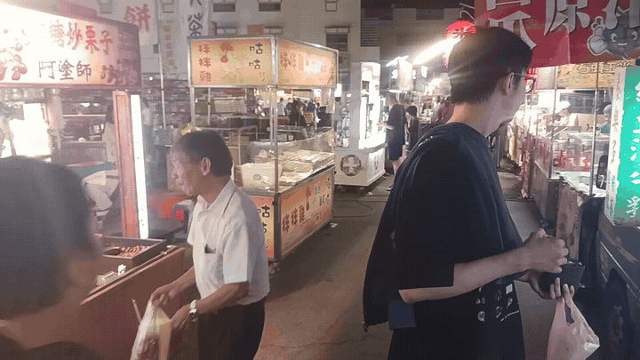
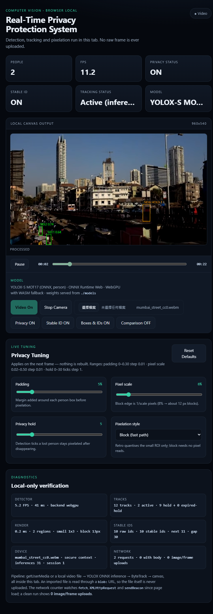
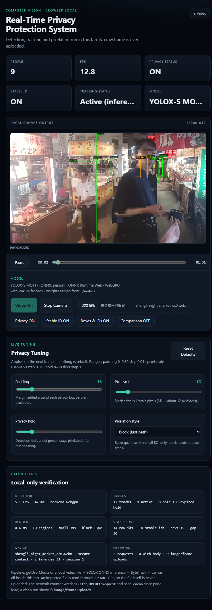

# Real-Time Privacy Protection System

Browser-local person detection, tracking, and privacy masking with **YOLOX-S MOT17**, **ByteTrack**, short-term **Stable ID** reassociation, privacy hold, and configurable pixelation.

> 繁體中文摘要：這是一個在瀏覽器本機執行的人物隱私保護系統。Webcam 與本機影片會在分頁內完成偵測、追蹤與像素化；應用程式不會把原始影格上傳到後端。

## Live demo / portfolio

**Live demo:** https://y0u1357.github.io/real-time-privacy-protection/


### Demo clip

<p align="center">
  
</p>

<sub>4-second CC0 benchmark clip from the Shengli Night Market stress-test scene. The interactive browser demo above shows the full detection, tracking, Stable ID, and privacy pipeline.</sub>


### Visual evidence

<table>
<tr>
<td align="center">
<a href="docs/assets/mumbai_street_cc0-demo.png"></a>
</td>
<td align="center">
<a href="docs/assets/shengli_night_market_cc0-demo.png"></a>
</td>
</tr>
<tr>
<td><strong>Mumbai Street</strong><br>Baseline CC0 scene, 960×540.</td>
<td><strong>Shengli Night Market</strong><br>Dense 1080p stress case with crowding and occlusion.</td>
</tr>
</table>

The screenshots above are captured from the real browser pipeline. Raw measurement artifacts are committed for auditability:
[ Mumbai JSON ](benchmarks/results/mumbai_street_cc0.json) ·
[ Shengli JSON ](benchmarks/results/shengli_night_market_cc0.json).


For reproducible portfolio evidence, use the CC0 benchmark suite and the real
browser pipeline:

```powershell
python tools/download_benchmark_videos.py --only mumbai_street_cc0
python tools/setup_ort_web.py
python tools/run_portfolio_benchmark.py --video-id mumbai_street_cc0
```

This produces a machine-specific JSON measurement and a full-page demo
screenshot. See [docs/PORTFOLIO.md](docs/PORTFOLIO.md) for the presentation
checklist. The table below uses actual local WebGPU measurements; rerun the benchmark on a named browser/device before using the figures in a formal comparison.

## Architecture

```text
Webcam / Local Video
        ↓
YOLOX-S MOT17 (ONNX)
        ↓
ONNX Runtime Web (WebGPU → WASM fallback)
        ↓
ByteTrack
        ↓
Stable ID
        ↓
Privacy Hold + 5% Padding
        ↓
Block / Pixel-Art Pixelation
        ↓
Canvas Output
```

## Features

- Browser-local YOLOX-S MOT17 inference.
- WebGPU first, WASM fallback through ONNX Runtime Web.
- JavaScript ByteTrack port with Kalman prediction and two-stage association.
- Short-term Stable ID reassociation without person ReID.
- Motion-aware privacy hold after temporary detection loss.
- Adjustable padding, pixel scale, hold duration, palettes, and dithering.
- Webcam and local video-file sources.
- Pause / Play / seek for local video.
- Comparison, privacy, Stable ID, and overlay controls.
- Runtime diagnostics for FPS, inference latency, tracks, render cost, and network activity.
- Local video files use `blob:` URLs and are not uploaded by the application.

## Repository layout

| Path | Purpose |
| --- | --- |
| `web/` | Main browser-local application |
| `web/js/` | Detector, tracker, Stable ID, privacy, rendering, and UI |
| `web/models/` | Committed browser ONNX model plus provenance/validation metadata |
| `tools/serve_web.py` | Local static server with correct WASM/MJS MIME types |
| `tools/setup_ort_web.py` | Downloads pinned ONNX Runtime Web assets |
| `tools/export_yolox_onnx.py` | Exports and validates the YOLOX-S MOT17 ONNX model |
| `tools/download_benchmark_videos.py` | Downloads the documented CC0 benchmark clips |
| `tools/run_portfolio_benchmark.py` | Measures the real browser pipeline and captures portfolio evidence |
| `eval_wildtrack.py` | WildTrack C1 detection/privacy evaluation |
| `tests/` | Browser-local static and smoke tests |
| `yolox/`, `exps/` | Minimal Python source needed for model export/evaluation |
| `benchmarks/videos.json` | Reproducible CC0 benchmark video manifest |
| `docs/` | Architecture, model setup, and benchmark notes |
| `third_party/` | Third-party attribution and licenses |

The earlier FastAPI/server-rendered prototype and unrelated upstream deployment/demo files have been removed. The repository now tracks only the browser-local product, its evaluation/export support, and the source required to reproduce them.

## Quick start

### 1. Install Python support for model export

```powershell
python -m pip install -r requirements.txt
```

### 2. Download ONNX Runtime Web

```powershell
python tools/setup_ort_web.py
```

### 3. Browser model

The GitHub Pages demo uses the committed browser model:

```text
web/models/yolox_s_mot17.onnx
```

To reproduce that ONNX export from a trusted ByteTrack-S MOT17 checkpoint at
`pretrained/bytetrack_s_mot17.pth.tar`, run:

```powershell
python tools/export_yolox_onnx.py
```

See [docs/MODELS.md](docs/MODELS.md) for model provenance, hashes, and export details.

### 4. Run locally

```powershell
python tools/serve_web.py --port 8080
```

Open:

```text
http://localhost:8080/
```

Use this server instead of opening `web/index.html` directly because ONNX Runtime Web requires correct `.mjs` and `.wasm` MIME types.

## Testing

```powershell
python -m unittest tests.test_web -v
python -m unittest tests.test_docs -v
```

Browser/model smoke tests:

```powershell
python tests/smoke_web.py
python tests/smoke_loading.py
python tests/smoke_playback.py
python tests/smoke_privacy_fps.py
python tests/smoke_pixel_art.py
```

Smoke tests that need Chrome/Edge, the ONNX model, or local media will skip/fail clearly when those external assets are unavailable.


## Measured benchmark results

Measured on a local Windows machine with the browser pipeline using **WebGPU**.
These are machine/browser-specific engineering measurements, not universal
YOLOX performance claims.

| Scene | Backend | Video FPS | Detector FPS | Inference | Peak people | Image/frame uploads |
| --- | --- | ---: | ---: | ---: | ---: | ---: |
| [Mumbai Street (CC0)](benchmarks/results/mumbai_street_cc0.json) | WebGPU | 22.74 | 11.20 | 43.76 ms | 4 | 0 |
| [Shengli Night Market (CC0)](benchmarks/results/shengli_night_market_cc0.json) | WebGPU | 25.61 | 12.27 | 45.34 ms | 17 | 0 |

The dense night-market clip is included as a stress case for heavier crowding,
occlusion, and tracker/render load. Both measured runs kept the network
diagnostic at **0 image/frame uploads**.

## Reproducible CC0 benchmark videos

The portfolio test set uses two Wikimedia Commons videos released under
**CC0 1.0**: a short Mumbai street baseline and a dense/night Shengli night
market stress test. Source pages, authors and exact filenames are checked into
`benchmarks/videos.json`; the video binaries stay out of Git.

```powershell
python tools/download_benchmark_videos.py --list
python tools/download_benchmark_videos.py --only mumbai_street_cc0
python tools/download_benchmark_videos.py
```

See [docs/BENCHMARK.md](docs/BENCHMARK.md) for the acceptance checklist and the
metrics to capture for a portfolio run.

## Privacy boundary

Camera and local-video frames are processed in the current browser tab. `web/js/network-guard.js` monitors network APIs so the dashboard can surface unexpected requests; a normal run should report **0 image/frame uploads**.

This is not a formal anonymity guarantee. Privacy coverage still depends on detector/tracker accuracy and runtime behavior.

## Documentation

- [Architecture](docs/ARCHITECTURE.md)
- [Model setup](docs/MODELS.md)
- [Development notes](docs/DEVELOPMENT_NOTES.md)
- [Benchmark video suite](docs/BENCHMARK.md)
- [Portfolio presentation](docs/PORTFOLIO.md)
- [Security policy](SECURITY.md)
- [Third-party notices](THIRD_PARTY.md)

## Third-party work and license

This repository derives from and/or uses ByteTrack, YOLOX, ONNX Runtime Web, and Image-to-Pixel concepts/code. Keep the notices in [THIRD_PARTY.md](THIRD_PARTY.md) and the included license material when redistributing.
